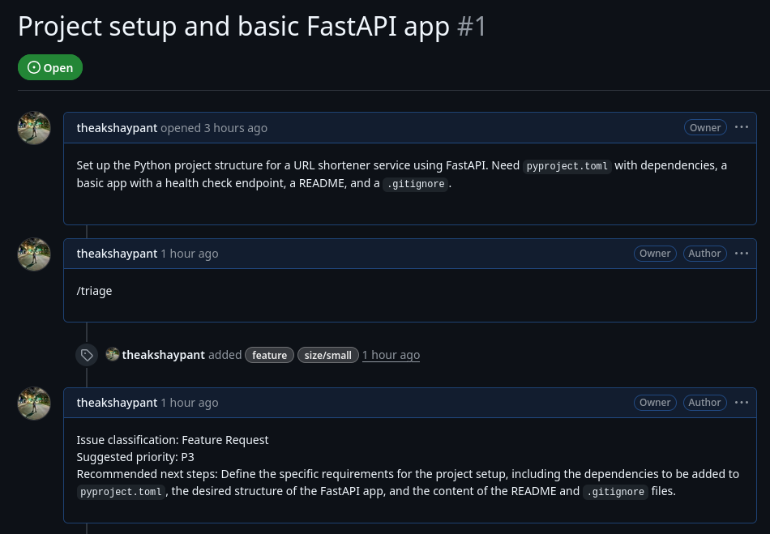
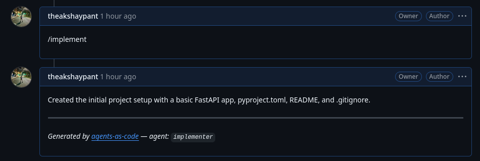
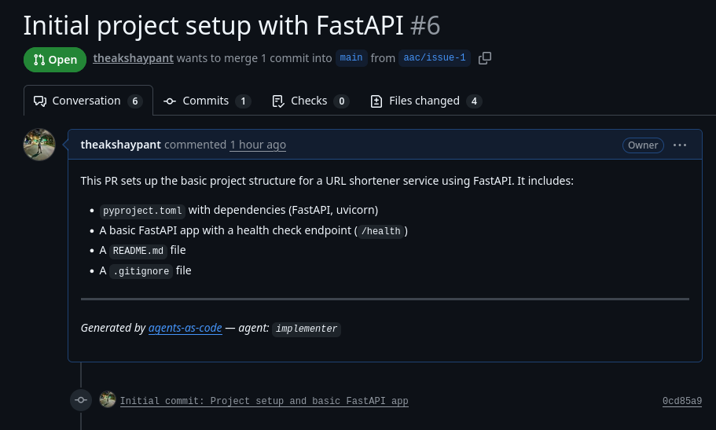
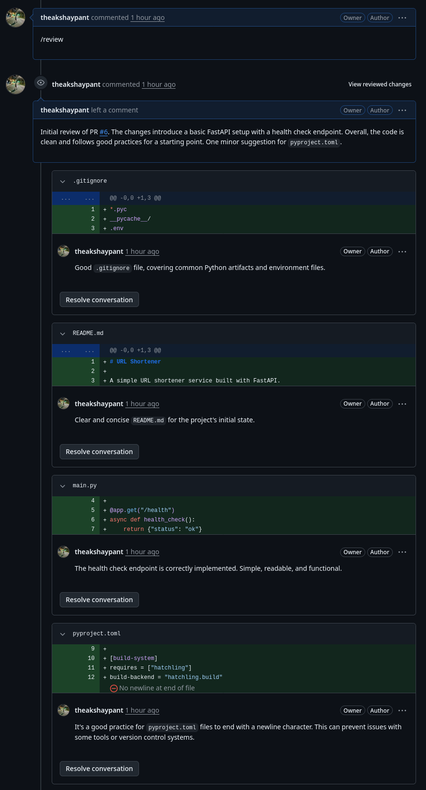

# Agents as Code (AAC)

> **Proof of Concept** — not production-ready. See the [Roadmap](docs/roadmap.md) for where it's heading.

Run AI agents on git events with declarative tool access and repo-aware context.

## Why

AAC explores what it looks like to bring AI agents into the Tekton ecosystem — defining agents the same way you define pipelines: as YAML in your repo, triggered by git events, executed on Kubernetes infrastructure. Code review, issue triage, and implementation agents fit naturally into the same model that CI/CD pipelines already use.

Template variables (`{{ pull_request_diff }}`, `{{ issue_comments }}`, etc.) inject rich context into agent prompts. Every agent runs in an isolated [K8s SIG Agent Sandbox](https://github.com/kubernetes-sigs/agent-sandbox) pod with a PydanticAI-based runtime. The infra team controls what's allowed (LLM provider, MCP servers, budget caps, network policy); developers control what each agent does.

## How It Works

1. Define agents in `.tekton/agents/` in your repository
2. Configure a Repository CR with LLM settings, MCP server catalog, and credentials
3. Trigger agents via git events or comment commands
4. The controller matches events to agents, runs each in a sandbox, and executes the structured result (comments, reviews, labels, commits, PRs, status checks)

## Working Examples

Three agents are live and producing real output on [theakshaypant/yeet-test](https://github.com/theakshaypant/yeet-test).

### Triage Agent

Labels issues and posts a triage summary when someone comments `/triage`.

<details>
<summary>Agent definition</summary>

```yaml
# .tekton/agents/triage.yaml
apiVersion: agent.tekton.dev/v1alpha1
kind: Agent
metadata:
  name: triage
  annotations:
    agent.tekton.dev/on-event: "issue_comment"
    agent.tekton.dev/on-comment: "/triage"
    agent.tekton.dev/result-hooks: "true"
spec:
  system_prompt: |
    You are an issue triage agent for {{ repo_owner }}/{{ repo_name }}.

    Analyze the issue below and perform these actions:
    1. Classify the issue by type and add appropriate labels
    2. Assess complexity and add a size label: "size/small", "size/medium", or "size/large"
    3. Post a triage summary comment

    ## Issue
    **{{ issue_title }}**
    {{ issue_body }}

    ## Current labels
    {{ issue_labels }}
  limits:
    max_tokens: 8000
    timeout_seconds: 120
```

</details>

**Actual output on [issue #1](https://github.com/theakshaypant/yeet-test/issues/1) ("Project setup and basic FastAPI app"):**

<!-- Screenshot: GitHub issue #1 showing the /triage comment, the agent's triage
     summary reply (classification, priority, next steps), and the `feature` +
     `size/small` labels applied to the issue sidebar. Capture the full issue
     page so labels and comment are both visible. -->


### Implementer Agent

Clones the repo into the sandbox, reads the codebase, implements changes, commits them, and opens a PR — all from a `/implement` comment.

<details>
<summary>Agent definition</summary>

```yaml
# .tekton/agents/implementer.yaml
apiVersion: agent.tekton.dev/v1alpha1
kind: Agent
metadata:
  name: implementer
  annotations:
    agent.tekton.dev/on-event: "issue_comment"
    agent.tekton.dev/on-comment: "/implement"
    agent.tekton.dev/clone-repo: "true"
    agent.tekton.dev/result-hooks: "true"
spec:
  system_prompt: |
    You are a coding agent for {{ repo_owner }}/{{ repo_name }}.
    The repo is cloned at {{ repo_clone_path }}.
    Use the workspace tools to explore the codebase and implement the requested changes.

    ## Issue context
    **{{ issue_title }}**
    {{ issue_body }}

    ## Instructions
    1. Read and understand the relevant code
    2. Implement the requested changes
    3. Produce a result with a "create-pr", "commit", and "comment" action
  limits:
    max_tokens: 200000
    timeout_seconds: 600
```

</details>

**Actual output on [issue #1](https://github.com/theakshaypant/yeet-test/issues/1):**

The agent created branch `aac/issue-1`, committed 4 files, and opened [PR #6](https://github.com/theakshaypant/yeet-test/pull/6).

<!-- Screenshot 1: GitHub issue #1 showing the /implement comment and the agent's
     reply comment ("Created the initial project setup...") with the
     agents-as-code footer. -->


<!-- Screenshot 2: GitHub PR #6 overview — title ("Initial project setup with
     FastAPI"), branch name (aac/issue-1 → main), the PR body listing the 4
     committed files, and the agents-as-code footer. Show the "Files changed"
     tab or at least the file list (.gitignore, README.md, main.py,
     pyproject.toml). -->


### Reviewer Agent

Posts a PR review with inline comments on specific files and lines when someone comments `/review` or a PR is opened.

<details>
<summary>Agent definition</summary>

```yaml
# .tekton/agents/reviewer.yaml
apiVersion: agent.tekton.dev/v1alpha1
kind: Agent
metadata:
  name: reviewer
  annotations:
    agent.tekton.dev/on-event: "[pull_request, issue_comment]"
    agent.tekton.dev/on-target-branch: "main"
    agent.tekton.dev/on-comment: "/review"
    agent.tekton.dev/result-hooks: "true"
spec:
  system_prompt: |
    You are a code review agent for {{ repo_owner }}/{{ repo_name }}.
    Review PR #{{ pull_request_number }} ("{{ pull_request_title }}").

    Focus on bugs, security vulnerabilities, performance issues,
    and code readability. Provide inline review comments on specific
    files and lines.

    ## Diff
    {{ pull_request_diff }}
  limits:
    max_tokens: 50000
    timeout_seconds: 300
```

</details>

**Actual output on [PR #6](https://github.com/theakshaypant/yeet-test/pull/6#pullrequestreview-4262438843) ("Initial project setup with FastAPI"):**

The agent submitted a review with 4 inline comments across the changed files.

<!-- Screenshot: PR #6 "Conversation" tab showing the review — the summary
     comment ("Initial review of PR #6...") with the COMMENTED badge, AND the
     collapsed inline comments visible below it (GitHub shows them as
     "4 comments on 4 files" with the expandable file-level comments like
     main.py, pyproject.toml, etc.). Capture the full review block so both
     the summary and the inline comments are visible in one shot. -->


## Documentation

- [Getting Started](docs/guides/getting-started.md) — deploy AAC locally with kind and test it end-to-end
- [Writing Agents](docs/guides/writing-agents.md) — agent definitions, triggers, template variables, tools, instructions, and result hooks
- [Architecture & Concepts](docs/reference/concepts.md) — event flow, trust model, execution model
- [Configuration](docs/reference/configuration.md) — Repository CR settings: AI, MCP servers, network, runtime
